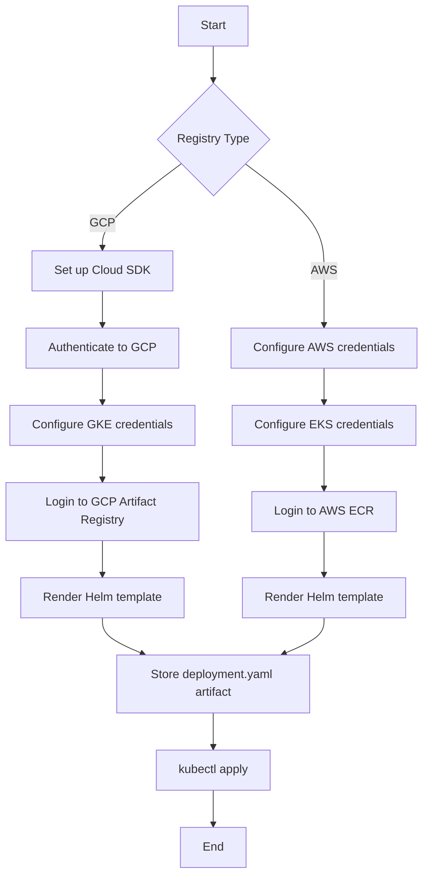

# Usage

## Overview

This GitHub Action is designed to deploy Helm charts to Kubernetes clusters.
It simplifies the CI/CD workflow by automating the process of pulling Helm charts
from a registry and deploying them to a Kubernetes cluster.

The action performs the following steps:

1. Authenticates with the specified cloud registry (GCP or AWS)
2. Logs into the Helm OCI registry
3. Renders the Helm chart using `helm template`
4. Stores the generated `deployment.yaml` as an artifact for debugging
5. Applies the manifest to Kubernetes using `kubectl apply`

Supported registries:

- **GCP Artifact Registry** - Google Cloud's container and artifact registry
- **AWS ECR** - Amazon Elastic Container Registry

## Prerequisites

Secrets Configuration

Before using this action, ensure that you have the following secrets configured in your GitHub repository:

### GCP Artifact Registry

* **GCP_WORKLOAD_IDENTITY_PROVIDER:** Workload identity provider for GCP authentication.
* **GCP_SERVICE_ACCOUNT:** The email of the service account to use for GCP authentication.

### AWS ECR

* **AWS_ROLE_ARN:** The IAM Role ARN configured for GitHub OIDC authentication (e.g., `arn:aws:iam::123456789012:role/github-actions-role`).

## Inputs

### Action Inputs

| Input | Description | Required | Default |
|-------|-------------|----------|---------|
| `registry` | Registry to pull the Helm chart from. Valid values: `gcp`, `aws` | Yes | - |
| `region` | Region where the registry is located | Yes | - |
| `repository_name` | Repository name in the registry | Yes | - |
| `environment` | Environment name for deployment | No | `""` |
| `gcp_project_id` | Google Cloud Project ID (required for GCP registry) | No | `""` |
| `workload_identity_provider` | Workload Identity Provider (required for GCP registry) | No | `""` |
| `service_account` | Service Account (required for GCP registry) | No | `""` |
| `cluster_name` | Kubernetes cluster name (required for GCP and AWS registries) | No | `""` |
| `aws_role_arn` | AWS IAM Role ARN for OIDC authentication (required for AWS registry) | No | `""` |
| `chart_name` | Name of the Helm chart to deploy | Yes | - |
| `chart_version` | Version of the Helm chart to deploy | Yes | - |
| `chart_value_file` | Path to the Helm values file | Yes | - |
| `version` | Application version to set in the deployment | No | `""` |

### Environment Variables

The following environment variables can be used to customize the deployment:

| Variable | Description | Required |
|----------|-------------|----------|
| `TAG_VERSION` | The version tag for the application (used if `version` input is not provided) | No |

## Examples

Here are examples of how to use this GitHub Action to deploy Helm charts
to Kubernetes clusters.

### GCP Artifact Registry to GKE

```yaml
name: Deploy

on:
  push:
    branches:
      - main

jobs:
  gcp:
    permissions:
      contents: write
      id-token: write
    runs-on: ubuntu-24.04
    steps:
      - uses: actions/checkout@v6
        with:
          fetch-depth: 50
          fetch-tags: true
      - name: Tag
        uses: martoc/action-tag@v0
        with:
          skip-push: true
      - name: Deploy
        uses: martoc/action-helm-deploy@v0
        with:
          registry: gcp
          region: europe-west2
          repository_name: repository
          gcp_project_id: project-id
          workload_identity_provider: ${{ secrets.GCP_WORKLOAD_IDENTITY_PROVIDER }}
          service_account: ${{ secrets.GCP_SERVICE_ACCOUNT }}
          cluster_name: your-cluster
          chart_name: your-chart
          chart_version: 1.0.0
          chart_value_file: values.yaml
          environment: production

  with-version:
    permissions:
      contents: write
      id-token: write
    runs-on: ubuntu-24.04
    steps:
      - uses: actions/checkout@v6
        with:
          fetch-depth: 50
          fetch-tags: true
      - name: Deploy with specific version
        uses: martoc/action-helm-deploy@v0
        with:
          registry: gcp
          region: europe-west2
          repository_name: repository
          gcp_project_id: project-id
          workload_identity_provider: ${{ secrets.GCP_WORKLOAD_IDENTITY_PROVIDER }}
          service_account: ${{ secrets.GCP_SERVICE_ACCOUNT }}
          cluster_name: your-cluster
          chart_name: your-chart
          chart_version: 1.0.0
          chart_value_file: values.yaml
          version: 2.0.0
```

### AWS ECR to EKS

```yaml
name: Deploy

on:
  push:
    branches:
      - main

jobs:
  aws:
    permissions:
      contents: write
      id-token: write
    runs-on: ubuntu-24.04
    steps:
      - uses: actions/checkout@v6
        with:
          fetch-depth: 50
          fetch-tags: true
      - name: Tag
        uses: martoc/action-tag@v0
        with:
          skip-push: true
      - name: Deploy
        uses: martoc/action-helm-deploy@v0
        with:
          registry: aws
          region: eu-west-1
          repository_name: repository
          aws_role_arn: ${{ secrets.AWS_ROLE_ARN }}
          cluster_name: your-cluster
          chart_name: your-chart
          chart_version: 1.0.0
          chart_value_file: values.yaml
          environment: production

  with-version:
    permissions:
      contents: write
      id-token: write
    runs-on: ubuntu-24.04
    steps:
      - uses: actions/checkout@v6
        with:
          fetch-depth: 50
          fetch-tags: true
      - name: Deploy with specific version
        uses: martoc/action-helm-deploy@v0
        with:
          registry: aws
          region: eu-west-1
          repository_name: repository
          aws_role_arn: ${{ secrets.AWS_ROLE_ARN }}
          cluster_name: your-cluster
          chart_name: your-chart
          chart_version: 1.0.0
          chart_value_file: values.yaml
          version: 2.0.0
```

## Registry-Specific Requirements

### GCP Artifact Registry

* `registry` input must be set to `gcp`
* `region` input is required
* `repository_name` input is required
* `gcp_project_id` input is required
* `workload_identity_provider` input is required
* `service_account` input is required
* `cluster_name` input is required

### AWS ECR

* `registry` input must be set to `aws`
* `region` input is required
* `repository_name` input is required
* `aws_role_arn` input is required (store as a GitHub secret)
* `cluster_name` input is required (the action automatically configures EKS credentials)

## Helm Values

The action automatically sets the following values when deploying the chart:

### GCP Registry

* `appVersion` - Set to `TAG_VERSION` environment variable or `version` input
* `environment` - Set to the `environment` input value
* `gcpProjectId` - Set to the `gcp_project_id` input value
* `region` - Set to the `region` input value

### AWS Registry

* `appVersion` - Set to `TAG_VERSION` environment variable or `version` input
* `environment` - Set to the `environment` input value
* `region` - Set to the `region` input value

## Deployment Artifacts

The action automatically stores the generated `deployment.yaml` as a GitHub Actions artifact with a 30-day retention period. The artifact name is derived from the `chart_value_file` input, with slashes replaced by hyphens.

This is useful for:

- Debugging deployment issues
- Auditing what was deployed
- Comparing deployments across environments

You can download the artifact from the GitHub Actions workflow run summary page.

## Workflow Diagram

The following diagram illustrates the deployment workflow:


